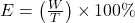

# Benchmark for Scandinavian Language Tokenizers
This repo provides tools for evaluating the efficiency of various tokenizers for Swedish, Danish, Norwegian Bokmål and  Norwegian Nynorsk. It will also support English for comparison. Here we meassure the tokenizer efficiency by tokenizing a total of 100k words from the top 500 Wikipedia pages for this language.

Tokenizer efficincy, 𝐸, can be defined as the ratio of the total number of words, 𝑊, to the total number of tokens, 𝑇, multiplied by 100 to express it as a percentage:

<div align="center">
    
</div>

### Scandinavian Tokenizers

| Tokenizer                                                                               | Type          | Vocab Size   |   en |   sv |   da |   no |   nn | Average   |   Tokens/Word |
|:----------------------------------------------------------------------------------------|:--------------|:-------------|-----:|-----:|-----:|-----:|-----:|:----------|--------------:|
| [Viking](https://hf.co/LumiOpen/Viking-7B)                                              | BPE           | 131,072      |   76 |   68 |   70 |   69 |   69 | 70.9%     |          1.41 |
| [MBart](https://hf.co/facebook/mbart-large-en-ro)                                       | SentencePiece | 250,027      |   74 |   65 |   67 |   67 |   63 | 68.0%     |          1.48 |
| [Gemma](https://hf.co/google/gemma-7b)                                                  | SentencePiece | 256,000      |   81 |   60 |   61 |   61 |   60 | 65.0%     |          1.56 |
| [norMistral](https://hf.co/norallm/normistral-7b-scratch)                               | BPE           | 32,768       |   62 |   52 |   62 |   70 |   66 | 62.9%     |          1.61 |
| [mT5](https://hf.co/google/mt5-small)                                                   | SentencePiece | 250,100      |   69 |   58 |   60 |   60 |   58 | 61.7%     |          1.63 |
| [NB-GPT-J](https://hf.co/NbAiLab/nb-gpt-j-6B-v2)                                        | BPE           | 50,257       |   89 |   46 |   49 |   50 |   48 | 56.8%     |          1.87 |
| [GPT-J](https://hf.co/EleutherAI/gpt-j-6b)                                              | BPE           | 50,257       |   89 |   46 |   49 |   50 |   48 | 56.8%     |          1.87 |
| [GPT2](https://hf.co/gpt2)                                                              | BPE           | 50,257       |   89 |   46 |   49 |   50 |   48 | 56.8%     |          1.87 |
| [Roberta](https://hf.co/roberta-base)                                                   | BPE           | 50,265       |   89 |   46 |   49 |   50 |   48 | 56.8%     |          1.87 |
| [Llama](https://hf.co/meta-llama/Llama-2-7b-hf)                                         | BPE           | 32,000       |   71 |   50 |   49 |   49 |   49 | 54.1%     |          1.89 |
| [Mistral](https://hf.co/mistralai/Mistral-7B-Instruct-v0.2)                             | BPE           | 32,000       |   72 |   48 |   48 |   48 |   48 | 53.3%     |          1.93 |
| [KBLab-Megatron](https://hf.co/KBLab/megatron.bert-large.unigram-64k-pretok.500k-steps) | WordPiece     | 64,005       |   52 |   61 |   45 |   45 |   45 | 50.1%     |          2.02 |


### Not Fully Supported Tokenizers

| Tokenizer                                                       | Type          | Vocab Size   | Scand Test   | Nordic Test   | Eng Test   | Average   |   Tokens/Word |
|:----------------------------------------------------------------|:--------------|:-------------|:-------------|:--------------|:-----------|:----------|--------------:|
| [NB-BERT](https://hf.co/NbAiLab/nb-bert-large)                  | WordPiece     | 50,000       | OK (lower)   | Failed        | OK (lower) | 86.0%     |          1.3  |
| [norT5](https://hf.co/ltg/nort5-base)                           | SentencePiece | 50,000       | Failed       | Failed        | Failed     | 82.5%     |          1.4  |
| [mBERT](https://hf.co/bert-base-multilingual-uncased)           | WordPiece     | 105,879      | Failed       | Failed        | OK (lower) | 72.8%     |          1.34 |
| [KBLab-BERT](https://hf.co/KBLab/bert-base-swedish-cased)       | WordPiece     | 50,325       | Failed       | Failed        | Success    | 63.2%     |          1.51 |
| [Saattrupdan-no](https://hf.co/saattrupdan/tokenizer-no)        | Unigram     | 30,000       | OK (lower)   | OK (lower)    | OK (lower) | 59.2%     |          1.94 |
| [Saattrupdan-scand](https://hf.co/saattrupdan/tokenizer-scandi) | Unigram     | 100,000      | OK (lower)   | OK (lower)    | OK (lower) | 56.3%     |          1.84 |
| [Bert](https://hf.co/bert-base-uncased)                         | WordPiece     | 30,522       | Failed       | Failed        | OK (lower) | 52.3%     |          1.74 |
| [DistilBert](https://hf.co/distilbert-base-uncased)             | WordPiece     | 30,522       | Failed       | Failed        | OK (lower) | 52.3%     |          1.74 |
| [LayoutLM](https://hf.co/microsoft/layoutlm-base-uncased)       | WordPiece     | 30,522       | Failed       | Failed        | OK (lower) | 52.3%     |          1.74 |
| [XLNet](https://hf.co/xlnet-base-cased)                         | SentencePiece | 32,000       | Failed       | Failed        | Success    | 41.0%     |          2.21 |
| [T5](https://hf.co/t5-base)                                     | SentencePiece | 32,100       | Failed       | Failed        | Success    | 36.9%     |          2.46 |


# sample_wikipedia.py
This script creates a corpus for Wikipedia articles for the defined set of languages. It is a tool for creating the tokenization benchmark. It extracts the first 200 words from each article on a specified date. Articles shorter than 200 words are dropped. In the default mode it samples until it has reached 100k words.

To create the corpus files, run the command below:
```bash
for lang in en no nn da sv; do python sample_wikipedia.py --language $lang --output_file wikipedia_100k/wiki_$lang.txt --num_articles 500 --num_words 200;done
for lang in en no nn da sv; do python sample_wikipedia.py --language $lang --output_file wikipedia_1k/wiki_$lang.txt --num_articles 50 --num_words 20;done
```

# run_test.py
This script runs the test and creates the tables in this document.

```bash
python run_test.py
```

# Faster test run
python run_test.py --directory wikipedia_1k/
```


